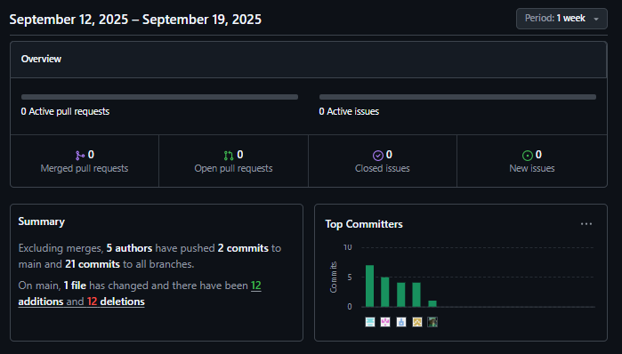

    

    
### UNIVERSIDAD PERUANA DE CIENCIAS APLICADAS

### INGENIERÍA DE SOFTWARE

### CICLO 2025-02

Código del curso: 1ASI0572
Nombre del curso: Desarrollo de Soluciones IOT 
NRC: 3475 
Nombre del Profesor: Marco Antonio Leon Baca 

# INFORME DEL TRABAJO FINAL

Nombre del StartUp: Pet-Love-Health  
Nombre del Producto: UPet 
Relación de Integrantes:

- U20221d014 - Alonso Garay, Diego Jesus
- U201922146 - Apaza Morales, Fabricio
- U202216558 - Rentería Puga, Héctor Marcelo
- U20201f846 - Oshiiro Yamashita, Daiki Oscar
- u20181g752 - Miranda Sinarahua, Piero Stephano

Noviembre, 2025.

 

## Historial de Versiones

<table>
<tr>
    <th colspan="3">Versión</th>
    <th colspan="3">Fecha</th>
    <th colspan="10">Autores</td>
    <th colspan="5">Descripción de Modificaciones</td>
  <tr>
    <td colspan="3">1era</td>
    <td colspan="3">19/9/2025</td>
    <td colspan="10">Marcelo Rentería Puga, Diego Alonso Garay, Fabricio Apaza Morales, Daiki Oshiiro Yamashita, Piero Miranda Sinarahua.</td>
    <td colspan="5">
     - Primera versión 
     - Creación del informe 
     - Capítulo 1 al 4 
  </tr>
    <tr>
    <td colspan="3">2da</td>
    <td colspan="3">8/10/2025</td>
    <td colspan="10">Marcelo Rentería Puga, Diego Alonso Garay, Fabricio Apaza Morales, Daiki Oshiiro Yamashita, Piero Miranda Sinarahua.</td>
    <td colspan="5">
     - Segunda versión 
     - Correcciones del informe 
     - Capítulo 5 al 6 
  </tr>
    <tr>
    <td colspan="3">3ra</td>
    <td colspan="3">14/11/2025</td>
    <td colspan="10">Marcelo Rentería Puga, Diego Alonso Garay, Fabricio Apaza Morales, Daiki Oshiiro Yamashita, Piero Miranda Sinarahua.</td>
    <td colspan="5">
     - Tercera versión 
     - Sprint 2 
     - Entrevistas de Validación 
  </tr>
  </table>

## Índice:

[Part I: As-Is Software Project 
Capítulo I: Introducción 
1.1. Startup Profile 
1.1.1. Descripción de la Startup 
1.1.2. Perfiles de integrantes del equipo 
1.2. Solution Profile 
1.2.1. Antecedentes y problemática 
1.2.2. Lean UX Process. 
1.2.2.1. Lean UX Problem Statements. 
1.2.2.2. Lean UX Assumptions. 
1.2.2.3. Lean UX Hypothesis Statements. 
1.2.2.4. Lean UX Canvas. 
1.3. Segmentos objetivo.](https://github.com/pet-love-health/final-report/blob/chapter-i/docs/chapter-i.md)

[Capítulo II: Requirements Elicitation & Analysis 
2.1. Competidores. 
2.1.1. Análisis competitivo. 
2.1.2. Estrategias y tácticas frente a competidores. 
2.2. Entrevistas. 
2.2.1. Diseño de entrevistas. 
2.2.2. Registro de entrevistas. 
2.2.3. Análisis de entrevistas. 
2.3. Needfinding. 
2.3.1. User Personas. 
2.3.2. User Task Matrix. 
2.3.3. User Journey Mapping. 
2.3.4. Empathy Mapping. 
2.4. Big Picture EventStorming. 
2.5. Ubiquitous Language.](https://github.com/pet-love-health/final-report/blob/chapter-ii/docs/chapter-ii.md)

[Capítulo III: Requirements Specification 
3.1. User Stories. 
3.3. Product Backlog. 
3.4. Impact Mapping.](https://github.com/pet-love-health/final-report/blob/chapter-iii/docs/chapter-iii.md)

[Capítulo IV: Solution Software Design. 
4.1. Strategic-Level Domain-Driven Design. 
4.1.1. Design-Level EventStorming. 
4.1.1.1 Candidate Context Discovery. 
4.1.1.2 Domain Message Flows Modeling. 
4.1.1.3 Bounded Context Canvases. 
4.1.2. Context Mapping. 
4.1.3. Software Architecture. 
4.1.3.1. Software Architecture System Landscape Diagram. 
4.1.3.2. Software Architecture Context Level Diagrams. 
4.1.3.2. Software Architecture Container Level Diagrams. 
4.1.3.3. Software Architecture Deployment Diagrams. 
4.2. Tactical-Level Domain-Driven Design 
4.2.1. Bounded Context: 
4.2.1.1. Domain Layer. 
4.2.1.2. Interface Layer. 
4.2.1.3. Application Layer. 
4.2.1.4. Infrastructure Layer. 
4.2.1.5. Bounded Context Software Architecture Component Level Diagrams. 
4.2.1.6. Bounded Context Software Architecture Code Level Diagrams. 
4.2.1.6.1. Bounded Context Domain Layer Class Diagrams. 
4.2.1.6.2. Bounded Context Database Design Diagram.](https://github.com/pet-love-health/final-report/blob/chapter-iv/docs/chapter-iv.md)

[Capítulo V: Solution UI/UX Design. 
5.1. Style Guidelines. 
5.1.1. General Style Guidelines. 
5.1.2. Web, Mobile and IoT Style Guidelines. 
5.2. Information Architecture. 
5.2.1. Organization Systems. 
5.2.2. Labeling Systems. 
5.2.3. SEO Tags and Meta Tags 
5.2.4. Searching Systems. 
5.2.5. Navigation Systems. 
5.3. Landing Page UI Design. 
5.3.1. Landing Page Wireframe. 
5.3.2. Landing Page Mock-up. 
5.4. Applications UX/UI Design. 
5.4.1. Applications Wireframes. 
5.4.2. Applications Wireflow Diagrams. 
5.4.2. Applications Mock-ups. 
5.4.3. Applications User Flow Diagrams. 
5.5. Applications Prototyping.](https://github.com/pet-love-health/final-report/blob/chapter-v/docs/chapter-v.md)

[Capítulo VI: Product Implementation, Validation & Deployment. 
6.1. Software Configuration Management. 
6.1.1. Software Development Environment Configuration. 
6.1.2. Source Code Management. 
6.1.3. Source Code Style Guide & Conventions. 
6.1.4. Software Deployment Configuration. 
6.2. Landing Page, Services & Applications Implementation. 
6.2.1. Sprint 1 
6.2.1.1. Sprint Planning 1.  
6.2.1.2. Aspect Leaders and Collaborators. 
6.2.1.3. Sprint Backlog 1. 
6.2.1.4. Development Evidence for Sprint Review. 
6.2.1.5. Testing Suite Evidence for Sprint Review. 
6.2.1.6. Execution Evidence for Sprint Review. 
6.2.1.7. Services Documentation Evidence for Sprint Review. 
6.2.1.8. Software Deployment Evidence for Sprint Review. 
6.2.1.9. Team Collaboration Insights during Sprint. 
6.2.2. Sprint 2 
6.2.2.1. Sprint Planning 2. 
6.2.2.2. Aspect Leaders and Collaborators. 
6.2.2.3. Sprint Backlog 2. 
6.2.2.4. Development Evidence for Sprint Review. 
6.2.2.5. Testing Suite Evidence for Sprint Review. 
6.2.2.6. Execution Evidence for Sprint Review. 
6.2.2.7. Services Documentation Evidence for Sprint Review. 
6.2.2.8. Software Deployment Evidence for Sprint Review. 
6.2.2.9. Team Collaboration Insights during Sprint. 
6.3. Validation Interviews. 
6.3.1. Diseño de Entrevistas. 
6.3.2. Registro de Entrevistas. 
6.3.3. Evaluaciones según heurísticas. 
Capítulo VII: Conclusiones.  
Capítulo VIII: Bibliografía. 
Capítulo IX: Anexos.](https://github.com/pet-love-health/final-report/blob/chapter-vi/docs/chapter-vi.md)

## Project Report Collaboration Insights

A continuación, se detalla el proceso de elaboración del informe para cada entrega, junto con capturas de pantalla que muestran los análisis de colaboración y commits en GitHub para el repositorio del informe:

**URL del Repositorio del Informe:** https://github.com/pet-love-health/final-report 

Se divieron las siguientes ramas para la colaboración en el proyecto:

- master
- chapter-i
- chapter-ii
- chapter-iii
- chapter-iv
- chapter-v
- chapter-vi

A continuación se presentan los gráficos de colaboración de los integrantes del equipo en el repositorio de nuestro primera entrega. Estos gráficos ofrecen una representación visual de la cantidad de contribuciones realizadas por cada miembro del equipo, junto con la fecha en que se llevaron a cabo. Además, se presenta información sobre la cantidad de líneas de código que se han modificado en cada uno de los commits.

# Student Outcome

<table> <tr> <th colspan="2">Criterio Específico</th> <th colspan="10">Acciones Realizadas</th> <th colspan="2">Conclusiones</th> </tr>
    <tr> <td colspan="2">Trabaja en equipo para proporcionar liderazgo en forma conjunta</td> <td colspan="10">
        <b>Héctor Marcelo Rentería Puga</b>  TB1: En este avance del proyecto, me enfoqué en liderar a mi equipo para avanzar equitativamente cada parte necesaria para cubrir las bases del proyecto. Mantuve comunicación constante y gestioné el tiempo adecuadamente. 
        TP: En este avance del proyecto, me enfoqué en liderar las correcciones y avances correspondientes, mientras organizaba cada acción para entregar un producto coherente. 
        TB2: En este avance del proyecto, me enfoqué en liderar los avances correspondientes, mientras preparaba los desplegables para entregar un producto coherente. 
        <b>Diego Alonso Garay</b> TB1: En esta entrega, me enfoqué en avanzar mi parte designada en colaboración con mi equipo, manteniendo comunicación constante para participar en los momentos necesarios. 
        TP: En esta entrega, me enfoqué en avanzar mi parte designada en colaboración con mi equipo, manteniendo comunicación constante para participar en los momentos necesarios. 
        <b>Daiki Oshiiro Yamashita</b> TB1: En este avance del proyecto, me enfoqué en colaborar activamente con mi equipo, asegurándome de cumplir con las tareas asignadas y apoyar a mis compañeros cuando era necesario. Mantener una comunicación constante y compartir ideas fue fundamental para garantizar que el equipo avanzara de manera coordinada y eficiente, logrando los objetivos propuestos.  TP1: En este avance del proyecto, participé activamente en el trabajo en equipo, cumpliendo mis tareas y apoyando a mis compañeros. La comunicación constante y el intercambio de ideas permitieron un progreso coordinado hacia los objetivos planteados.  TB2: En este avance del proyecto, trabajé en equipo por medio del liderazgo en forma conjunta con los demás integrantes del equipo, y por eso mismo logramos cumplir con las metas asignadas para el avance. 
        <b>Fabricio Apaza Morales</b>  TB1: En esta entrega, me enfoqué en avanzar mi parte designada en colaboración con mi equipo, manteniendo comunicación constante para participar en los momentos necesarios.  TP1: En este avance, participé activamente con mi equipo, colaborando en el desarrollo del Chapter VI. Por otro lado, hice correcciones en el Chapter IV con respecto a los lineamientos enfocados para un proyecto IoT  TB2: Participé de forma activa con respecto a las entrevistas de validación. A demás, se realizaron las corrrecciones correspondientes con respecto a las mejoras continuas proporcionadas. 
      <b>Piero Miranda Sinarahua</b>  TB1: En esta entrega, me enfoqué en avanzar mi parte designada en colaboración con mi equipo, manteniendo comunicación constante para participar en los momentos necesarios.   TP:Para este entrega, colabore con mis compañeros de grupo para designar las secciones en las que se trabajaría durante el primer Sprint, al igual que el desarrollo de nuevos capítulos para el informe, y redacción de historias de usuario faltantes, demostrando liderazgo de manera conjunta con mis compañeros.   TB2: Participe en conjunto con mi equipo para completar las actividades planteadas durante el Sprint 2, demostrando liderazgo dentro del equipo de trabajo.  </td> 
        <td colspan="2"> La colaboración activa y la comunicación constante permiten que el equipo avance de manera coordinada y eficiente. El intercambio de ideas y el apoyo mutuo fortalecen la ejecución de las tareas y contribuyen al logro de los objetivos del proyecto.</td>
    </tr> <tr> <td colspan="2">Crea un entorno colaborativo e inclusivo, establece metas, planifica tareas y cumple objetivos.</td> <td colspan="10">
        <b>Héctor Marcelo Rentería Puga</b>  TB1: En este avance del proyecto, me enfoqué en colaborar activamente con mi equipo, asegurándome de cumplir con las tareas asignadas y apoyar a mis compañeros cuando era necesario. Mantener una comunicación constante y compartir ideas fue fundamental para garantizar que el equipo avanzara de manera coordinada y eficiente, logrando los objetivos propuestos.  
        TP: En esta entrega, en enfoqué en colaborar con mi equipo para que nuestras partes puedan avanzar de forma organizada, asegurando que la parte de uno no se adelante o atrase a la de otros. 
        TP: En esta entrega, en enfoqué en colaborar con mi equipo para que nuestras partes puedan avanzar de forma organizada, asegurando que las partes necesarias sean cumplidas a tiempo. 
        <b>Diego Alonso Garay</b> TB1: En esta entrega, me enfoqué en avanzar mi parte designada en colaboración con mi equipo, manteniendo comunicación constante para participar en los momentos necesarios. 
        TP: En esta entrega, me enfoqué en avanzar mi parte designada en colaboración con mi equipo, manteniendo comunicación constante para participar en los momentos necesarios. 
        <b>Daiki Oshiiro Yamashita</b> TB1:En este avance del proyecto, me enfoqué en contribuir a un entorno de trabajo colaborativo, compartiendo ideas y respetando las opiniones de todos los miembros del equipo. Participé en la planificación de tareas y en el establecimiento de metas claras, asegurándome de cumplir con mis responsabilidades para que el equipo lograra los objetivos de manera organizada y eficiente.  TP1: En este avance del proyecto, promoví un entorno colaborativo al compartir ideas y respetar las opiniones del equipo. Participé en la planificación de tareas y en la definición de metas, cumpliendo mis responsabilidades para contribuir al logro eficiente de los objetivos.  TB2: En este avance del proyecto, participé en la colaboración del equipo de manera activa para así poder lograr una buena comunicación y por esto musmo la ejecución de tareas contribuyeron al logro de los objetivos planteados para el trabajo. 
        <b>Fabricio Apaza Morales</b>  TB1: En esta entrega, me enfoqué en avanzar mi parte designada en colaboración con mi equipo, manteniendo comunicación constante para participar en los momentos necesarios.  TP1: En este avance, participé activamente con mi equipo, colaborando en el desarrollo del Chapter VI. Por otro lado, hice correcciones en el Chapter IV con respecto a los lineamientos enfocados para un proyecto IoT  TB2: Participé de forma activa con respecto a las entrevistas de validación. A demás, se realizaron las corrrecciones correspondientes con respecto a las mejoras continuas proporcionadas. 
      <b>Piero Miranda Sinarahua</b>  TB1: En esta entrega, me enfoqué en avanzar mi parte designada en colaboración con mi equipo, manteniendo comunicación constante para participar en los momentos necesarios.  TP: Para esta entrega, comparti un entorno colaborativo en el cual contribui con el equipo en lo requerido para alcanzar lo establecido para este avance del proyecto. Se planificaron tareas en conjunto, de las cuales estuve a cargo de la implementación del capitulo v y correcciones en relación a la entrega pasada. Todo lo realizado fue teniendo en cuenta los objetivos planeados por el equipo.  TB2: Planifique los objetivos que debia cumplir durante el Sprint 2, y se establecieron las metas a las que se debia llegar durante esta entrega, fomentando la participación de los integrantes del equipo de trabajo.  </td>
        <td colspan="2">Un entorno inclusivo y organizado, acompañado de la planificación clara de metas y tareas, facilita la efectividad del equipo. La participación de todos los miembros y el respeto por las opiniones promueven un desempeño ordenado y la consecución de resultados de calidad. </td> </tr> </table>
