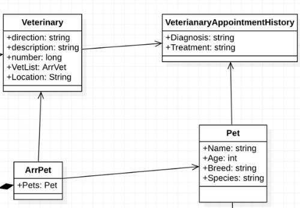

# Capítulo IV: Solution Software Design.
## 4.1. Strategic-Level Domain-Driven Design.
### 4.1.1. Design-Level EventStorming.
Se llevó a cabo un proceso de Event Storming para identificar los Bounded Contexts de nuestro sistema. Durante este
proceso, se siguieron los pasos que se describen a continuación:

Collect Domain Events 

Se plantean eventos importantes de todos los grupos funcionales en tiempo pasado y nomenclatura en inglés.

Timeline

Se ordenan todos los eventos y se empieza con un “happy path” es decir, eventos exitosos.

Pain and Pivotal Points

En este paso se resaltan con un diamante los eventos por aclarar o que requieren de más conocimientos de especialistas.
Por otro lado, los pivotal points son puntos de cambios que se marcan con una barra vertical.
Por otro lado, los pivotal points son puntos de cambios que se marcan con una barra vertical.

#### 4.1.1.1 Candidate Context Discovery

#### 4.1.1.2 Domain Message Flows Modeling.

Dado el diagrama de eventos de EventStorming que ya se ha presentado, el siguiente paso es modelar los flujos de
mensajes. Para esto, podemos identificar las interacciones clave que ocurren en el sistema, y cómo estos mensajes 
desencadenan acciones o actualizaciones en otros contextos.

Solicitud de inicio de sesión: En este escenario, un actor (Customer) crea una cuenta en nuestro sistema y, de inmediato, 
se suscribe al plan predeterminado para validar sus credenciales, gracias a una política establecida. Este evento se
registra en nuestro backend, lo que confirma la suscripción. Una vez verificada la suscripción dentro del bounded
context de *Access*, al cliente se le permitirá acceder al comando de solicitud de inicio de sesión (Sign in request).

**Búsqueda de una veterinaria:** En este escenario, un actor (Customer) interactúa con el frontend solicitando el 
ingreso a su cuenta mediante el comando (*Sign in request*). Tras realizar las validaciones de credenciales en *Account 
Access* y verificar la cuenta, se le permitirá al cliente buscar veterinarias usando el comando (*Search Vet*). Una vez 
que acceda a esta función a través del frontend, el evento de (*Results searched*) será activado en nuestro backend 
dentro del bounded context de *Research and appointment*. Finalmente, podrá seleccionar el perfil de una veterinaria
mediante (*Select Vet profile*).

**Agendar una cita con un veterinario:** En este escenario, tras verificar las credenciales del cliente al iniciar
sesión, se le permite elegir un perfil de veterinario. Una vez completada esta acción, nuestro backend activa el evento
(*Vet profile selected*) y el cliente puede solicitar una cita utilizando el comando (*Request appointment*).

**Manejar el historial médico de la mascota:** Para gestionar el historial médico, el actor (Customer) solicita una cita
con un veterinario. Luego, se le pedirá información relevante sobre diagnósticos de enfermedades y actualizaciones de
reportes. Este comando se ejecuta desde nuestro frontend mediante (*Collect medical information*). Si la información se 
completa, se envía a la plataforma a través de (*Send medical information to platform*). Finalmente, una vez que toda la
información esté en nuestro backend, el veterinario puede actualizar el historial médico de la mascota usando el 
comando (*Update medical history*).

#### 4.1.1.3 Bounded Context Canvases.

Se crearon lienzos de Bounded Context para cada uno de los contextos identificados en el proceso de EventStorming.
Estos lienzos ayudan a definir los límites de cada contexto, sus responsabilidades y las interacciones
con otros contextos.

### 4.1.2. Context Mapping.
### 4.1.3.1 Software Architecture.

En esta sección, se describe la Arquitectura de Software de la solución utilizando el C4 Model para su representación visual, a través de la herramienta Structurizr. Se introducirá la estructura general del sistema, comenzando por una vista de alto nivel (Context Level Diagram) y detallando las interacciones y componentes clave (Container Level Diagrams), proporcionando así una visión clara y comprensible de la arquitectura propuesta.

#### 4.1.3.2. Software Architecture System Landscape Diagram.
#### 4.1.3.3. Software Architecture Context Level Diagrams.

A continuación mostramos el diagrama de contexto de la arquitectura de software de la solución propuesta. En este diagrama se presentan los actores externos que interactúan con el sistema y los sistemas externos con los que se comunica.

#### 4.1.3.4. Software Architecture Container Level Diagrams.

En esta sección se presenta el diagrama de contenedores de la solución propuesta. Este diagrama detalla los contenedores de software y sus interrelaciones, proporcionando una visión general de la estructura interna del sistema.

#### 4.1.3.5. Software Architecture Deployment Diagrams.
## 4.2. Tactical-Level Domain-Driven Design
### 4.2.1. Bounded Context:  Identity and Access Context
#### 4.2.1.1. Domain Layer
#### Models
| **Clase**        | **Descripción**                                                                                                                                                                                                |
|------------------|----------------------------------------------------------------------------------------------------------------------------------------------------------------------------------------------------------------|
| **User**         | Representa la entidad de usuario con atributos como `id`, `name`, `email`, `password`, `userType`, etc. Relacionado con `PetOwner` y `Veterinarian`.                                                           |
| **PetOwner**     | Representa la entidad de propietario de mascotas con atributos como `id`, `userId`, `numberPhone`, `location`, `subscriptionType`, etc. Relacionado con `User`, `Pet`, y `Review`.                             |
| **Veterinarian** | Representa la entidad de veterinario con atributos como `id`, `user_id`, `description`, `experience`, `clinic_id`, etc. Relacionado con `User`, `VeterinaryClinic`, `Availability`, `Appointment`, y `Review`. |

#### Enums
| **Enum**             | **Descripción**                                                   |
|----------------------|-------------------------------------------------------------------|
| **UserType**         | Enum para los tipos de usuarios: `Vet`, `Owner`.                  |
| **SubscriptionType** | Enum para los tipos de suscripciones: `Basic`, `Advanced`, `Pro`. |

#### Validators
| **Clase**           | **Descripción**                                                                                                       |
|---------------------|-----------------------------------------------------------------------------------------------------------------------|
| **SchemaValidator** | Contiene métodos para validar esquemas, asegurando que los campos requeridos estén presentes en los datos de entrada. |

#### 4.2.1.2. Interface Layer
Description of the design and components of the interface layer for the Identity and Access Context.

#### Schemas
| **Esquema**                       | **Descripción**                                                                                                                                                                                                   |
|-----------------------------------|-------------------------------------------------------------------------------------------------------------------------------------------------------------------------------------------------------------------|
| **UserSchemaGet**                 | Esquema para la respuesta de la obtención de un usuario. Incluye `id`, `name`, `email`, `userType`, `image_url`, `registered`.                                                                                    |
| **UserSchemaPost**                | Esquema para la creación de un nuevo usuario. Incluye `name`, `email`, `password`, `userType`.                                                                                                                    |
| **UserChangeImage**               | Esquema para actualizar la imagen de un usuario. Incluye `image_url`, `role`.                                                                                                                                     |
| **VeterinarianSchemaPost**        | Esquema para la creación de un nuevo veterinario. Incluye `clinicName`, `otp_password`.                                                                                                                           |
| **VeterinarianUpdateInformation** | Esquema para la actualización de la información de un veterinario. Incluye `name`, `description`, `experience`.                                                                                                   |
| **VeterinarianSchemaGet**         | Esquema para la respuesta de la obtención de un veterinario. Incluye `id`, `name`, `clinicId`, `image_url`, `description`, `experience`, `user_id`.                                                               |
| **VeterinarianProfileSchemaGet**  | Esquema para la respuesta detallada del perfil de un veterinario. Incluye `id`, `name`, `image_url`, `description`, `experience`, `clinicName`, `workingHourStart`, `workingHourEnd`, `clinicAddress`, `reviews`. |

#### 4.2.1.3. Application Layer
Description of the design and components of the application layer for the Identity and Access Context.

#### Services

| **Servicio**            | **Método**                                                                                       | **Descripción**                                                                                                                                            |
|-------------------------|--------------------------------------------------------------------------------------------------|------------------------------------------------------------------------------------------------------------------------------------------------------------|
| **UserService**         | `get_user_by_id(user_id: int, db: Session)`                                                      | Recupera un usuario por su ID. Lanza una excepción 404 si el usuario no existe.                                                                            |
|                         | `change_image(role_id: int, role, image: str, db: Session)`                                      | Cambia la imagen de perfil del usuario según su rol (Owner o Veterinarian). Actualiza la entidad `User` y guarda los cambios.                              |
| **PetOwnerService**     | `create_new_petowner(user_id: int, petowner: PetOwnerSchemaPost, db: Session = Depends(get_db))` | Crea un nuevo registro de propietario de mascotas. Verifica el tipo de usuario, si ya está registrado y el formato del teléfono. Emite un token de acceso. |
|                         | `get_petowners(db: Session = Depends(get_db))`                                                   | Recupera todos los propietarios de mascotas, incluyendo sus datos de usuario asociados.                                                                    |
|                         | `get_petowner_by_user_id(user_id: int, db: Session)`                                             | Recupera un propietario de mascotas por su ID de usuario.                                                                                                  |
|                         | `get_petOwner_by_id(petOwner_id: int, db: Session) -> PetOwnerSchemaGet`                         | Recupera un propietario de mascotas por su ID.                                                                                                             |
|                         | `change_Datapetowner(petowner_id: int, petowner: PetOwnerUpdateInformation, db: Session)`        | Actualiza los datos de un propietario de mascotas existente.                                                                                               |
| **VeterinarianService** | `create_new_veterinarian(user_id: int, veterinarian: VeterinarianSchemaPost, db: Session)`       | Crea un nuevo registro de veterinario. Verifica el tipo de usuario, si ya está registrado, y valida el OTP y la clínica. Emite un token de acceso.         |
|                         | `get_all_vets(db: Session = Depends(get_db)) -> List[VeterinarianSchemaGet]`                     | Recupera todos los veterinarios, incluyendo sus datos de usuario asociados.                                                                                |
|                         | `get_vet_by_user_id(user_id: int, db: Session) -> VeterinarianSchemaGet`                         | Recupera un veterinario por su ID de usuario.                                                                                                              |
|                         | `get_vet_by_id(vet_id: int, db: Session) -> VeterinarianSchemaGet`                               | Recupera un veterinario por su ID.                                                                                                                         |
|                         | `get_vet_by_id_details(vet_id: int, db: Session) -> VeterinarianProfileSchemaGet`                | Recupera información detallada sobre un veterinario, incluyendo reseñas.                                                                                   |
|                         | `get_vets_by_clinic_id(clinic_id: int, db: Session) -> List[VeterinarianSchemaGet]`              | Recupera veterinarios por ID de clínica.                                                                                                                   |
|                         | `get_available_times(vet_id: int, day: date, db: Session)`                                       | Recupera los horarios disponibles para un veterinario en un día específico.                                                                                |
|                         | `change_DataVet(vet_id: int, vet: VeterinarianUpdateInformation, db: Session)`                   | Actualiza los datos de un veterinario existente.                                                                                                           |

#### 4.2.1.4. Infrastructure Layer
Description of the design and components of the infrastructure layer for the Identity and Access Context.\

#### **Repositorios**

| Clase/Servicio             | Descripción                                                                                           |
|----------------------------|-------------------------------------------------------------------------------------------------------|
| **UserRepository**         | Maneja la interacción con la base de datos para la entidad `User`. Incluye operaciones como crear, leer, actualizar y eliminar usuarios. |
| **PetOwnerRepository**     | Maneja la interacción con la base de datos para la entidad `PetOwner`. Permite crear, leer, actualizar y eliminar propietarios de mascotas. |
| **VeterinarianRepository** | Maneja la interacción con la base de datos para la entidad `Veterinarian`. Incluye operaciones de gestión de veterinarios como crear, leer, actualizar y eliminar. |

#### **Mappers**

| Clase/Servicio             | Descripción                                                                                           |
|----------------------------|-------------------------------------------------------------------------------------------------------|
| **UserMapper**             | Mapea la entidad `User` a la base de datos usando SQLAlchemy. Define cómo se traducen las propiedades del modelo `User` en columnas de la tabla de base de datos. |
| **PetOwnerMapper**         | Mapea la entidad `PetOwner` a la base de datos usando SQLAlchemy. Define cómo se traducen las propiedades del modelo `PetOwner` en columnas de la tabla de base de datos. |
| **VeterinarianMapper**     | Mapea la entidad `Veterinarian` a la base de datos usando SQLAlchemy. Define cómo se traducen las propiedades del modelo `Veterinarian` en columnas de la tabla de base de datos. |

#### Routes

| **Ruta**                                                             | **Método**   | **Descripción**                                                                                                           |
|----------------------------------------------------------------------|--------------|---------------------------------------------------------------------------------------------------------------------------|
| **PetOwners**                                                         |              |                                                                                                                           |
| `/petowners/{user_id}`                                                | POST         | Crear un nuevo propietario de mascotas.                                                                                  |
| `/petowners`                                                          | GET          | Obtener todos los propietarios de mascotas.                                                                             |
| `/petowners/users/{user_id}`                                          | GET          | Obtener un propietario de mascotas por ID de usuario.                                                                    |
| `/petowners/{petOwner_id}`                                            | GET          | Obtener un propietario de mascotas por ID de propietario.                                                                |
| `/petowners/{petOwner_id}`                                            | PUT          | Actualizar la información de un propietario de mascotas.                                                                 |
| **Users**                                                             |              |                                                                                                                           |
| `/users`                                                              | GET          | Obtener todos los usuarios.                                                                                             |
| `/users/{user_id}`                                                    | GET          | Obtener un usuario por ID.                                                                                              |
| `/users/{role_id}`                                                    | PUT          | Cambiar la imagen de un usuario.                                                                                        |
| **Veterinarians**                                                     |              |                                                                                                                           |
| `/veterinarians/{user_id}`                                            | POST         | Crear un nuevo veterinario.                                                                                             |
| `/veterinarians`                                                      | GET          | Obtener todos los veterinarios.                                                                                         |
| `/veterinarians/users/{user_id}`                                      | GET          | Obtener un veterinario por ID de usuario.                                                                               |
| `/veterinarians/{vet_id}`                                             | GET          | Obtener un veterinario por ID.                                                                                          |
| `/veterinarians/vets/{clinic_id}`                                    | GET          | Obtener veterinarios por ID de clínica.                                                                                  |
| `/veterinarians/reviews/{vet_id}`                                    | GET          | Obtener detalles del perfil de un veterinario, incluyendo reseñas.                                                        |
| `/veterinarians/{vet_id}/available_times`                            | POST         | Obtener los horarios disponibles de un veterinario.                                                                     |
| `/veterinarians/{vet_id}`                                             | PUT          | Actualizar la información de un veterinario.                                                                            |

#### 4.2.1.5. Bounded Context Software Architecture Component Level Diagrams
Component-level diagrams for the Identity and Access Context, showing the internal structure of components.

#### 4.2.1.6. Bounded Context Software Architecture Code Level Diagrams
##### 4.2.1.6.1. Bounded Context Domain Layer Class Diagrams
Class diagrams for the domain layer of the Identity and Access Context.

##### 4.2.1.6.2. Bounded Context Database Design Diagram
Database design diagram for the Identity and Access Context.

### 4.2.2. Bounded Context:  Pets
#### 4.2.2.1. Domain Layer
#### Aggregate
| **Aggregates**               | **Descripción**                                                                                                                                                                |
|------------------------------|--------------------------------------------------------------------------------------------------------------------------------------------------------------------------------|
| **Pet**     | Representa a la entidad de Pet. Tiene atributos como: `id`, `name`, `petOwnerId`, `breed`, `species`, `weight`, `birthdate`, `image_url`, `gender`. Esta relacionado con PetOwner, Appointments, SmartCollars. |

#### Enums 
| **Enums**               | **Descripción**                                                                                                                                                                |
|------------------------------|--------------------------------------------------------------------------------------------------------------------------------------------------------------------------------|
| **SpeciesEnum**     | Enum para los tipos de especies `Dog`, `Cat`, `Bird`, `Fish`, `Reptile`, `Rodent`, `Rabbit, Other`. |

#### Validators
| **Clase**           | **Descripción**                                                                                                       |
|---------------------|-----------------------------------------------------------------------------------------------------------------------|
| **SchemaValidator** | Contiene métodos para validar esquemas, asegurando que los campos requeridos estén presentes en los datos de entrada. |

#### 4.2.3.2 Interface Layer

Description of the design and components of the interface layer for the Pet Context.

#### Schemas

| Esquema                      | Descripción                                                                                                                           |
| ---------------------------- | ------------------------------------------------------------------------------------------------------------------------------------- |
| **PetSchemaPost**     | Esquema para la creación de un Pet. Incluye `name`, `breed`, `species`, `weight`, `birthdate`, `image_url, gender`. |
| **PetSchemaGet**    | Esquema para la respuesta al obtener información de un Pet. Incluye `id`, `name`, `petowner`, `breed`, `species`, `weight`, `birthdate`, `image_url, gender`.  |
| **PetSchemaUpdate**  | Esquema para actualizar información de un Pet. Incluye `name`, `breed`, `species`, `weight`, `birthdate`, `image_url, gender`. |

#### 4.2.2.2 Application Layer

Description of the design and components of the application layer for the Pet Context

#### Services

| **Servicio**              | **Método**                                                                                     | **Descripción**                                                                                          |
| ------------------------- | ---------------------------------------------------------------------------------------------- | -------------------------------------------------------------------------------------------------------- |
| **PetService**            |  `create_new_pet(petowner_id: int, pet: PetSchemaPost, db: Session)`                          | Crea un nuevo Pet segun el esuqema post para Pet.   |
|                           | `get_pet_by_user_id(pet_id: int, db: Session)`                                                 | Obtiene un Pet segun el id del user      |
|                           | `get_pets_by_petOwnerid(petOwner_id: int, db: Session)`                                        | Obtiene una lista de Pets segun el pet owner.         |
|                           | `update_pet(pet_id: int, pet: PetSchemaPost, db: Session)`                                     | Actualiza informacion de un pet.      |
|                           | `get_pet_by_id(pet_id: int, db: Session))`                                                     | Obtiene pet segun su id.          |
|                           | `delete_pet(pet_id: int, db: Session)`                                                         | Elimina un pet.                                             |
|                           | `get_petowners(db: Session)`                                                                   | Obtiene los pet owners.        |

#### 4.2.2.4. Infrastructure Layer

Description of the design and components of the infrastructure layer for the Pet Context.

#### **Repositorios**

| **Repositorio**             | **Descripción**                                                                                   |
| --------------------------- | ------------------------------------------------------------------------------------------------- |
| **PetRepository**   | Maneja la interaccion con la base de datos para la entidad Pet. Incluye operaciones para la gestion de Pets como crear, leer, actualizar y eliminar.  |

### **Mappers**

| **Mapeador**     | **Descripción**                                                                                                                                                                                |
| ----------------------- | --------------------------------------------------------------------------------------------------------------------------------------------------------------------------------------- |
| **PetMapper**   | Mapea la entidad Pet a la base de datos usando SQLAlchemy. Define cómo se traducen las propiedades del modelo Pet en columnas de la tabla de base de datos.                                 |

#### **Routes**

| **Ruta**                                | **Método HTTP** | **Descripción**                                                                 |
| --------------------------------------- | --------------- | ------------------------------------------------------------------------------- |
| `/pets/{petowner_id}`        | **POST**           | Crea un nuevo Pet para un PetOwner segun su ID                                            |
| `/pets`                         | **GET**         | Obtiene una lista de PetOwners.                         |
| `/pets/{petowner_id}`        | **GET**           | Obtiene una lista de Pets segun el ID del PetOwner.                                    |
| `/pets/{pet_id}`            | **PUT**            | Actualiza la informacion de un Pet segun su ID.                                        |
| `/pets/pet/{pet_id}`            | **GET**        | Obtiene un Pet segun su ID.                                  |
| `/pets/{pet_id}`            | **DELETE**         | Elimina un pet segun su ID.                                  |

#### 4.2.2.5. Bounded Context Software Architecture Component Level Diagrams

Component-level diagrams for Pets, showing internal structure of components. 

 

#### 4.2.2.6. Bounded Context Software Architecture Code Level Diagrams

##### 4.2.2.6.1. Bounded Context Domain Layer Class Diagrams

Class diagrams for the domain layer of the Pet Context.

 

##### 4.2.2.6.2. Bounded Context Database Design Diagram

Database design diagram for the Pet Context.

 

### 4.2.3. Bounded Context:  Appointment
#### 4.2.3.1. Domain Layer
#### Aggregates

| **Aggregates**               | **Descripción**                                                                                                                                                                |
|------------------------------|--------------------------------------------------------------------------------------------------------------------------------------------------------------------------------|
| **AppointmentAggregate**     | Se asegura de la consistencia en la gestión de citas (programación, cancelación, finalización). Contiene las reglas de negocio como validación de horarios, cambios de estado. |
| **AvailabilityAggregate**    | Agrupa la lógica de los bloques de tiempo de los veterinarios. Se asegura de que no haya solapamiento y que los rangos horarios sean válidos.                                  |

#### Entities

| **Entities**     | **Descripción**                                                                                                           |
|------------------|---------------------------------------------------------------------------------------------------------------------------|
| **Appointment**  | Entidad raíz del agregado. Representa una cita con atributos: id, petId, veterinarianId, appointmentDate, status, notes.  |
| **Availability** | Entidad raíz para disponibilidad, con atributos: id, veterinarianId, dayOfWeek, startTime, endTime.                       | 
| **Review**       | Entidad dependiente, vinculada a Appointment. Contiene id, appointmentId, rating, comment, createdAt.                     |

#### Value Objects

| **Value Objects**    | **Descripción**                                                                                                                |
|----------------------|--------------------------------------------------------------------------------------------------------------------------------|
| **AppointmentData**  | Datos propios de la cita (fecha, estado, notas) que viajan entre capas a través de AppointmentService y AppointmentRepository. |
| **AvailabilityData** | Datos de disponibilidad (día, rango horario) gestionados por AvailabilityService y persistidos en AvailabilityRepository.      |

#### 4.2.3.2 Interface Layer

Description of the design and components of the interface layer for the Appointment Context.

#### Schemas

| Esquema                      | Descripción                                                                                                                           |
| ---------------------------- | ------------------------------------------------------------------------------------------------------------------------------------- |
| **AppointmentSchemaGet**     | Esquema para la respuesta de la obtención de una cita. Incluye `id`, `petId`, `veterinarianId`, `appointmentDate`, `status`, `notes`. |
| **AppointmentSchemaPost**    | Esquema para la creación de una cita. Incluye `petId`, `veterinarianId`, `appointmentDate`, `notes`.                                  |
| **AppointmentSchemaUpdate**  | Esquema para la actualización del estado o detalles de una cita. Incluye `appointmentId`, `status`, `notes`.                          |
| **AvailabilitySchemaGet**    | Esquema para la respuesta de la obtención de disponibilidad. Incluye `id`, `veterinarianId`, `dayOfWeek`, `startTime`, `endTime`.     |
| **AvailabilitySchemaPost**   | Esquema para la creación de disponibilidad de un veterinario. Incluye `veterinarianId`, `dayOfWeek`, `startTime`, `endTime`.          |
| **AvailabilitySchemaUpdate** | Esquema para la actualización de la disponibilidad existente. Incluye `id`, `dayOfWeek`, `startTime`, `endTime`.                      |

#### 4.2.3.3. Application Layer

Description of the design and components of the application layer for the Identity and Access Context.

#### Services

| **Servicio**              | **Método**                                                                                     | **Descripción**                                                                                          |
| ------------------------- | ---------------------------------------------------------------------------------------------- | -------------------------------------------------------------------------------------------------------- |
| **AppointmentService**    | `get_appointment_by_id(appointment_id: int, db: Session)`                                      | Recupera una cita por su ID. Lanza una excepción 404 si no existe.                                       |
|                           | `create_new_appointment(appointment: AppointmentSchemaPost, db: Session)`                      | Crea una nueva cita, validando disponibilidad del veterinario y existencia de la mascota.                |
|                           | `update_appointment(appointment_id: int, appointment: AppointmentSchemaUpdate, db: Session)`   | Actualiza el estado o notas de una cita existente.                                                       |
|                           | `get_appointments_by_pet(pet_id: int, db: Session)`                                            | Recupera todas las citas asociadas a una mascota específica.                                             |
|                           | `get_appointments_by_vet(vet_id: int, db: Session)`                                            | Recupera todas las citas asociadas a un veterinario.                                                     |
| **AvailabilityService**   | `get_availability_by_vet(vet_id: int, db: Session)`                                            | Recupera la disponibilidad de un veterinario.                                                            |
|                           | `create_availability(availability: AvailabilitySchemaPost, db: Session)`                       | Crea un nuevo registro de disponibilidad para un veterinario.                                            |
|                           | `update_availability(availability_id: int, availability: AvailabilitySchemaUpdate, db: Session)` | Actualiza una disponibilidad existente.                                                                |
|                           | `get_available_times(vet_id: int, day: date, db: Session)`                                     | Recupera los horarios disponibles para un veterinario en un día específico.                              |

#### 4.2.3.4. Infrastructure Layer

Description of the design and components of the infrastructure layer for the Appointment Context.

#### **Repositorios**

| **Repositorio**             | **Descripción**                                                                                   |
| --------------------------- | ------------------------------------------------------------------------------------------------- |
| **AppointmentRepository**   | Implementa la interfaz definida en el Domain Layer para manejar operaciones CRUD sobre citas. Incluye métodos para crear, actualizar, eliminar y consultar citas en la base de datos. |
| **AvailabilityRepository**  | Implementa la interfaz definida en el Domain Layer para manejar la disponibilidad de los veterinarios. Permite registrar, modificar y consultar horarios en la base de datos.         |

### **Mappers**

| **Mapeador**     | **Descripción**                                                                                                                                                                                |
| ----------------------- | --------------------------------------------------------------------------------------------------------------------------------------------------------------------------------------- |
| **AppointmentMapper**   | Convierte entre modelos de base de datos, entidades de dominio y esquemas (`AppointmentSchemaGet`, `AppointmentSchemaPost`, `AppointmentSchemaUpdate`).                                 |
| **AvailabilityMapper**  | Maneja la conversión de disponibilidad entre modelos de base de datos, entidades de dominio y esquemas (`AvailabilitySchemaGet`, `AvailabilitySchemaPost`, `AvailabilitySchemaUpdate`). |

#### **Routes**

| **Ruta**                                | **Método HTTP** | **Descripción**                                                                 |
| --------------------------------------- | --------------- | ------------------------------------------------------------------------------- |
| `/appointments/{appointment_id}`        | **GET**         | Obtiene una cita por su ID.                                                     |
| `/appointments`                         | **POST**        | Crea una nueva cita validando disponibilidad del veterinario.                   |
| `/appointments/{appointment_id}`        | **PUT**         | Actualiza el estado o notas de una cita existente.                              |
| `/appointments/pet/{pet_id}`            | **GET**         | Obtiene todas las citas asociadas a una mascota.                                |
| `/appointments/vet/{vet_id}`            | **GET**         | Obtiene todas las citas asociadas a un veterinario.                             |
| `/availability/vet/{vet_id}`            | **GET**         | Recupera la disponibilidad de un veterinario.                                   |
| `/availability`                         | **POST**        | Crea un nuevo registro de disponibilidad para un veterinario.                   |
| `/availability/{availability_id}`       | **PUT**         | Actualiza la disponibilidad existente.                                          |
| `/availability/vet/{vet_id}/day/{day}`  | **GET**         | Recupera los horarios disponibles de un veterinario en un día específico.       |

#### 4.2.3.5. Bounded Context Software Architecture Component Level Diagrams

Component-level diagrams for the Appointment Context, showing the internal structure of components.

 

#### 4.2.3.6. Bounded Context Software Architecture Code Level Diagrams

##### 4.2.3.6.1. Bounded Context Domain Layer Class Diagrams

Class diagrams for the domain layer of the Appointment Context.

 

##### 4.2.3.6.2. Bounded Context Database Design Diagram

Database design diagram for the Appointment Context.

 

### 4.2.4. Bounded Context:  Veterinaries
#### 4.2.4.1. Domain Layer
#### Models
| **Clase**        | **Descripción**                                                                                                                                                                                                |
|------------------|----------------------------------------------------------------------------------------------------------------------------------------------------------------------------------------------------------------|
| **Veterinarian** | Representa la entidad de veterinario con atributos como `id`, `user_id`, `description`, `experience`, `clinic_id`, etc. Relacionado con `User`, `VeterinaryClinic`, `Availability`, `Appointment`, y `Review`. |
| **VeterinaryClinic**     | Representa la entidad de clínica veterinaria con atributos como `id`, `user_id`, `clinic_id`, `services`, `office_hours_start`, `office_hours_end`, `phone_number`, `description`, `image_url`, etc. Relacionado con `Veterinarian` y `Favorite Clinic`.                             |
| **Favorite Clinic** | Representa la entidad de clínica favorita con atributos como `id`, `user_id`, `clinic_id`, etc. Relacionado con `User` y `Clinic`. |

#### Enums
| **Enum**             | **Descripción**                                                   |
|----------------------|-------------------------------------------------------------------|
| **UserType**         | Enum para los tipos de usuarios: `Vet`, `Owner`.                  |

#### Validators
| **Clase**           | **Descripción**                                                                                                       |
|---------------------|-----------------------------------------------------------------------------------------------------------------------|
| **SchemaValidator** | Contiene métodos para validar esquemas, asegurando que los campos requeridos estén presentes en los datos de entrada. |

#### 4.2.4.2. Interface Layer
Description of the design and components of the interface layer for the Identity and Access Context.

#### Schemas
| **Esquema**                       | **Descripción**                                                                                                                                                                                                   |
|-----------------------------------|-------------------------------------------------------------------------------------------------------------------------------------------------------------------------------------------------------------------|
| **VeterinarianSchemaPost**        | Esquema para la creación de un nuevo veterinario. Incluye `clinicName`, `otp_password`.                                                                                                                           |
| **VeterinarianUpdateInformation** | Esquema para la actualización de la información de un veterinario. Incluye `name`, `description`, `experience`.                                                                                                   |
| **VeterinarianSchemaGet**         | Esquema para la respuesta de la obtención de un veterinario. Incluye `id`, `name`, `clinicId`, `image_url`, `description`, `experience`, `user_id`.                                                               |
| **VeterinarianProfileSchemaGet**  | Esquema para la respuesta detallada del perfil de un veterinario. Incluye `id`, `name`, `image_url`, `description`, `experience`, `clinicName`, `workingHourStart`, `workingHourEnd`, `clinicAddress`, `reviews`. |
| **VeterinaryclinicSchemaPost**        | Esquema para la creación de una nueva clínica. Incluye `name`, `location`,`phone_number`, `description`,`office_hours_start`, `office_hours_end`.                                                                                                                           |
| **AvailabilitySchemaPost**        | Esquema para la creación de horarios disponibles. Incluye `date`.                                                                                                                           |
| **VeterinaryClinicSchemaGet**         | Esquema para la respuesta de la obtención de una clínica. Incluye `id`, `name`, `location`, `services`, `image_url`,`phone_number`, `description`,`office_hours_start`, `office_hours_end`.                                                             |
| **VeterinaryClinicSchemaGet**         | Esquema para la respuesta de la obtención de una clínica favorita. Incluye `id`, `clinics`.                                                             |

#### 4.2.4.3. Application Layer
Description of the design and components of the application layer for the Identity and Access Context.

#### Services

| **Servicio**            | **Método**                                                                                       | **Descripción**                                                                                                                                            |
|-------------------------|--------------------------------------------------------------------------------------------------|------------------------------------------------------------------------------------------------------------------------------------------------------------|
| **VeterinarianService** | `create_new_veterinarian(user_id: int, veterinarian: VeterinarianSchemaPost, db: Session)`       | Crea un nuevo registro de veterinario. Verifica el tipo de usuario, si ya está registrado, y valida el OTP y la clínica. Emite un token de acceso.         |
|                         | `get_all_vets(db: Session = Depends(get_db)) -> List[VeterinarianSchemaGet]`                     | Recupera todos los veterinarios, incluyendo sus datos de usuario asociados.                                                                                |
|                         | `get_vet_by_user_id(user_id: int, db: Session) -> VeterinarianSchemaGet`                         | Recupera un veterinario por su ID de usuario.                                                                                                              |
|                         | `get_vet_by_id(vet_id: int, db: Session) -> VeterinarianSchemaGet`                               | Recupera un veterinario por su ID.                                                                                                                         |
|                         | `get_vet_by_id_details(vet_id: int, db: Session) -> VeterinarianProfileSchemaGet`                | Recupera información detallada sobre un veterinario, incluyendo reseñas.                                                                                   |
|                         | `get_vets_by_clinic_id(clinic_id: int, db: Session) -> List[VeterinarianSchemaGet]`              | Recupera veterinarios por ID de clínica.                                                                                                                   |
|                         | `get_available_times(vet_id: int, day: date, db: Session)`                                       | Recupera los horarios disponibles para un veterinario en un día específico.                                                                                |
|                         | `change_DataVet(vet_id: int, vet: VeterinarianUpdateInformation, db: Session)`                   | Actualiza los datos de un veterinario existente.                                                                                                           |
| **VeterinaryClinicService** | `create_veterinary_clinic(clinic: VeterinaryClinicSchemaPost, db: Session)`       | Crea una nueva clínica veterinaria. Verifica que las horas de servicio tengan lógica.         |
|                         | `get_veterinary_clinics(db: Session) -> list[VeterinaryClinicSchemaGet]`                     | Recupera todas las clínicas veterinarias.                                                                                |
|                         | `generate_unique_password( clinic_id: int, db: Session)`                         | Genera el One Time Password de la clínica.                                                                                                              |
|                         | `verify_veterinarian_register(clinic_name: str, otp_password: str, db: Session)`                               | Verifica el One Time Password, y devuelve el id de la clínica relacionada.                                                                                                                         |
|                         | `get_veterinary_clinic_by_id(clinic_id: int, db: Session)`                | Recupera clínica por ID de veterinairo.                                                                                   |
| **FavoriteClinicService** | `get_favorite_clinics(user_id, db:Session = Depends(get_db)) -> list[VeterinaryClinicSchemaGet]`       | Recupera las clínicas favprotas de un usuario.         |
|                         | `toggle_favorite_clinic(user_id: int, clinic_id: int, db: Session = Depends(get_db)) -> bool`                     | Añade o elimina una clínica de la lista de favoritos.                                                                                |

#### 4.2.4.4. Infrastructure Layer
Description of the design and components of the infrastructure layer for the Identity and Access Context.\

#### **Repositorios**

| Clase/Servicio             | Descripción                                                                                           |
|----------------------------|-------------------------------------------------------------------------------------------------------|
| **VeterinarianRepository** | Maneja la interacción con la base de datos para la entidad `Veterinarian`. Incluye operaciones de gestión de veterinarios como crear, leer, actualizar y eliminar. |
| **VeterinaryClinicRepository** | Maneja la interacción con la base de datos para la entidad `VeterinaryClinic`. Incluye operaciones de gestión de clínicas como crear, leer, actualizar y eliminar. |
| **FavoriteClinicRepository** | Maneja la interacción con la base de datos para la entidad `FavoriteClinic`. Incluye operaciones de gestión de clínicas favoritas como crear, leer, actualizar y eliminar. |

#### **Mappers**

| Clase/Servicio             | Descripción                                                                                           |
|----------------------------|-------------------------------------------------------------------------------------------------------|
| **VeterinarianMapper**     | Mapea la entidad `Veterinarian` a la base de datos usando SQLAlchemy. Define cómo se traducen las propiedades del modelo `Veterinarian` en columnas de la tabla de base de datos. |
| **VeterinaryCliniMapper**             | Mapea la entidad `VeterinaryClinic` a la base de datos usando SQLAlchemy. Define cómo se traducen las propiedades del modelo `VeterinaryClinic` en columnas de la tabla de base de datos. |
| **FavoriteClinicMapper**         | Mapea la entidad `FavoriteClinic` a la base de datos usando SQLAlchemy. Define cómo se traducen las propiedades del modelo `FavoriteClinic` en columnas de la tabla de base de datos. |

#### Routes

| **Ruta**                                                             | **Método**   | **Descripción**                                                                                                           |
|----------------------------------------------------------------------|--------------|---------------------------------------------------------------------------------------------------------------------------|
| **Veterinarians**                                                     |              |                                                                                                                           |
| `/veterinarians/{user_id}`                                            | POST         | Crear un nuevo veterinario.                                                                                             |
| `/veterinarians`                                                      | GET          | Obtener todos los veterinarios.                                                                                         |
| `/veterinarians/users/{user_id}`                                      | GET          | Obtener un veterinario por ID de usuario.                                                                               |
| `/veterinarians/{vet_id}`                                             | GET          | Obtener un veterinario por ID.                                                                                          |
| `/veterinarians/vets/{clinic_id}`                                    | GET          | Obtener veterinarios por ID de clínica.                                                                                  |
| `/veterinarians/reviews/{vet_id}`                                    | GET          | Obtener detalles del perfil de un veterinario, incluyendo reseñas.                                                        |
| `/veterinarians/{vet_id}/available_times`                            | POST         | Obtener los horarios disponibles de un veterinario.                                                                     |
| `/veterinarians/{vet_id}`                                             | PUT          | Actualizar la información de un veterinario.                                                                            |
| **Veterinary Clinics**                                                     |              |                                                                                                                           |
| `/veterinary_clinics`                                            | POST         | Crear una nueva clínica.                                                                                             |
| `/veterinary_clinics`                                                      | GET          | Obtener todas las clínicas.                                                                                         |
| `/veterinary_clinics/generate_password/{clinic_id}`                                      | GET          | Generar un One Time Password por ID de clínica.                                                                               |
| `/veterinary_clinics/{clinic_id}`                                             | GET          | Obtener una clínica por ID.                                                                                          |
| **FavoriteClinics**                                                     |              |                                                                                                                           |
| `/favoriteClinics/userId/{user_id}/clinicId/{clinic_id}`                                    | POST          | Cambiar el estado de una clínica como favorita o no de un usuario por ID.                                                        |
| `/favoriteClinics/userId/{user_id}`                            | GET         | Obtener las clínicas favoritas por ID de usuaro.                                                                     |

#### 4.2.4.5. Bounded Context Software Architecture Component Level Diagrams
Component-level diagrams for the Veterinary, showing the internal structure of components.

#### 4.2.4.6. Bounded Context Software Architecture Code Level Diagrams
##### 4.2.4.6.1. Bounded Context Domain Layer Class Diagrams
Class diagrams for the domain layer of the Veterinary Context.

##### 4.2.4.6.2. Bounded Context Database Design Diagram
Database design diagram for the Veterinary Context.

### 4.2.5. Bounded Context: Medical History
#### 4.2.5.1. Domain Layer

#### Models
| **Clase**             | **Descripción**                                                                                                                                                                           |
|------------------------|-------------------------------------------------------------------------------------------------------------------------------------------------------------------------------------------|
| **MedicalHistory**     | Representa la historia médica de una mascota. Contiene información general y está relacionada con `Pet`, además de agrupar entidades como `Disease`, `Surgery`, `Vaccine` y `MedicalResult`. |
| **Disease**            | Representa una enfermedad registrada en la historia médica. Incluye atributos como `id`, `name`, `diagnosis_date`, `treatment`, etc. Relacionado con `MedicalHistory`.                      |
| **Surgery**            | Representa una cirugía realizada a la mascota. Incluye atributos como `id`, `name`, `date`, `description`, etc. Relacionado con `MedicalHistory`.                                         |
| **Vaccine**            | Representa una vacuna aplicada a la mascota. Incluye atributos como `id`, `name`, `application_date`, `next_dose_date`, etc. Relacionado con `MedicalHistory`.                             |
| **MedicalResult**      | Representa resultados médicos (análisis, laboratorios, exámenes clínicos). Incluye atributos como `id`, `type`, `date`, `description`, `result`, etc. Relacionado con `MedicalHistory`.     |

#### Enums
| **Enum**       | **Descripción**                                                                 |
|----------------|---------------------------------------------------------------------------------|
| **ResultType** | Enum para los tipos de resultados médicos: `LabTest`, `XRay`, `Ultrasound`, etc. |

#### Validators
| **Clase**           | **Descripción**                                                                                                       |
|---------------------|-----------------------------------------------------------------------------------------------------------------------|
| **SchemaValidator** | Valida los esquemas de entrada y asegura que los campos requeridos estén presentes en los datos enviados al sistema.  |

---

#### 4.2.5.2. Interface Layer
Description of the design and components of the interface layer for the Medical History Context.

#### Schemas
| **Esquema**                       | **Descripción**                                                                                                                           |
|-----------------------------------|-------------------------------------------------------------------------------------------------------------------------------------------|
| **MedicalHistorySchemaPost**      | Esquema para la creación de una historia médica. Incluye `pet_id`, `general_notes`.                                                        |
| **MedicalHistorySchemaGet**       | Esquema para la respuesta de la obtención de una historia médica. Incluye `id`, `pet_id`, `general_notes`, `diseases`, `surgeries`, `vaccines`, `medical_results`. |
| **DiseaseSchemaPost**             | Esquema para registrar una enfermedad dentro de una historia médica. Incluye `name`, `diagnosis_date`, `treatment`.                        |
| **DiseaseSchemaGet**              | Esquema de respuesta con la información de una enfermedad asociada a una historia médica.                                                   |
| **SurgerySchemaPost**             | Esquema para registrar una cirugía dentro de una historia médica. Incluye `name`, `date`, `description`.                                   |
| **SurgerySchemaGet**              | Esquema de respuesta con los datos de una cirugía asociada a la historia médica.                                                           |
| **VaccineSchemaPost**             | Esquema para registrar una vacuna aplicada. Incluye `name`, `application_date`, `next_dose_date`.                                          |
| **VaccineSchemaGet**              | Esquema de respuesta con los datos de una vacuna aplicada en la historia médica.                                                           |
| **MedicalResultSchemaPost**       | Esquema para registrar un resultado médico. Incluye `type`, `date`, `description`, `result`.                                                |
| **MedicalResultSchemaGet**        | Esquema de respuesta con los datos de un resultado médico registrado en la historia médica.                                                 |

---

#### 4.2.5.3. Application Layer
Description of the design and components of the application layer for the Medical History Context.

#### Services
| **Servicio**              | **Método**                                                                                                                           | **Descripción**                                                                                                      |
|---------------------------|--------------------------------------------------------------------------------------------------------------------------------------|----------------------------------------------------------------------------------------------------------------------|
| **MedicalHistoryService** | `add_medical_history(medical_history: MedicalHistorySchemaPost, db: Session)`                                                        | Crea una nueva historia médica asociada a una mascota.                                                                |
|                           | `get_all_medical_histories(db: Session)`                                                                                             | Obtiene todas las historias médicas registradas en el sistema.                                                        |
|                           | `get_medical_history_by_pet_id(pet_id: int, db: Session)`                                                                            | Recupera la historia médica asociada a un ID de mascota.                                                              |
|                           | `get_medical_history(medical_history_id: int, db: Session)`                                                                          | Recupera una historia médica específica por su ID.                                                                    |
|                           | `add_medical_result(medical_history_id: int, medical_result: MedicalResultSchemaPost, db: Session)`                                  | Agrega un nuevo resultado médico a una historia.                                                                      |
|                           | `add_disease(medical_history_id: int, disease: DiseaseSchemaPost, db: Session)`                                                      | Agrega una enfermedad a la historia médica.                                                                           |
|                           | `add_surgery(medical_history_id: int, surgery: SurgerySchemaPost, db: Session)`                                                      | Registra una cirugía en la historia médica.                                                                           |
|                           | `add_vaccine(medical_history_id: int, vaccine: VaccineSchemaPost, db: Session)`                                                      | Registra una vacuna aplicada en la historia médica.                                                                   |
|                           | `get_all_medical_results_by_id(medical_history_id: int, db: Session)`                                                                | Recupera todos los resultados médicos de una historia.                                                                |
|                           | `get_all_diseases_by_id(medical_history_id: int, db: Session)`                                                                       | Recupera todas las enfermedades asociadas a una historia.                                                             |
|                           | `get_all_surgeries_by_id(medical_history_id: int, db: Session)`                                                                      | Recupera todas las cirugías asociadas a una historia.                                                                 |
|                           | `get_all_vaccines_by_id(medical_history_id: int, db: Session)`                                                                       | Recupera todas las vacunas aplicadas en una historia.                                                                 |

---

#### 4.2.5.4. Infrastructure Layer
Description of the design and components of the infrastructure layer for the Medical History Context.

#### **Repositorios**
| Clase/Servicio                 | Descripción                                                                                           |
|--------------------------------|-------------------------------------------------------------------------------------------------------|
| **MedicalHistoryRepository**   | Maneja la interacción con la base de datos para la entidad `MedicalHistory`. Incluye CRUD y consultas específicas. |
| **DiseaseRepository**          | Maneja la interacción con la base de datos para la entidad `Disease`. Incluye operaciones de gestión de enfermedades. |
| **SurgeryRepository**          | Maneja la interacción con la base de datos para la entidad `Surgery`. Incluye operaciones de gestión de cirugías. |
| **VaccineRepository**          | Maneja la interacción con la base de datos para la entidad `Vaccine`. Incluye operaciones de gestión de vacunas. |
| **MedicalResultRepository**    | Maneja la interacción con la base de datos para la entidad `MedicalResult`. Incluye operaciones de gestión de resultados médicos. |

#### **Mappers**
| Clase/Servicio              | Descripción                                                                                           |
|-----------------------------|-------------------------------------------------------------------------------------------------------|
| **MedicalHistoryMapper**    | Mapea la entidad `MedicalHistory` con SQLAlchemy. Define cómo se traducen las propiedades a columnas de la tabla. |
| **DiseaseMapper**           | Mapea la entidad `Disease` con SQLAlchemy. |
| **SurgeryMapper**           | Mapea la entidad `Surgery` con SQLAlchemy. |
| **VaccineMapper**           | Mapea la entidad `Vaccine` con SQLAlchemy. |
| **MedicalResultMapper**     | Mapea la entidad `MedicalResult` con SQLAlchemy. |

---

#### Routes
| **Ruta**                                                                      | **Método** | **Descripción**                                                                                  |
|-------------------------------------------------------------------------------|------------|--------------------------------------------------------------------------------------------------|
| **MedicalHistories**                                                          |            |                                                                                                  |
| `/medicalhistories`                                                           | POST       | Crear una nueva historia médica.                                                                 |
| `/medicalhistories`                                                           | GET        | Obtener todas las historias médicas.                                                             |
| `/medicalhistories/pet/{pet_id}`                                              | GET        | Obtener la historia médica asociada a un ID de mascota.                                          |
| `/medicalhistories/{medical_history_id}`                                      | GET        | Obtener una historia médica por su ID.                                                           |
| `/medicalhistories/{medical_history_id}/medicalresults`                       | POST       | Agregar un resultado médico a una historia.                                                      |
| `/medicalhistories/{medical_history_id}/diseases`                             | POST       | Agregar una enfermedad a una historia.                                                           |
| `/medicalhistories/{medical_history_id}/surgeries`                            | POST       | Agregar una cirugía a una historia.                                                              |
| `/medicalhistories/{medical_history_id}/vaccines`                             | POST       | Agregar una vacuna a una historia.                                                               |
| `/medicalhistories/{medical_history_id}/medicalresults`                       | GET        | Obtener todos los resultados médicos de una historia.                                            |
| `/medicalhistories/{medical_history_id}/diseases`                             | GET        | Obtener todas las enfermedades de una historia.                                                  |
| `/medicalhistories/{medical_history_id}/surgeries`                            | GET        | Obtener todas las cirugías de una historia.                                                      |
| `/medicalhistories/{medical_history_id}/vaccines`                             | GET        | Obtener todas las vacunas de una historia.                                                       |

---

#### 4.2.5.5. Bounded Context Software Architecture Component Level Diagrams
Component-level diagrams for the Medical History, showing the internal structure of components.

---

#### 4.2.5.6. Bounded Context Software Architecture Code Level Diagrams
##### 4.2.5.6.1. Bounded Context Domain Layer Class Diagrams
Class diagrams for the domain layer of the Medical History Context.

##### 4.2.5.6.2. Bounded Context Database Design Diagram
Database design diagram for the Medical History Context.

### 4.2.6. Bounded Context: Notifications and Reviews

#### 4.2.6.1. Domain Layer
Description of the design and components of the domain layer for the User Experience Context.
### Models
| **Clase**       | **Descripción**  |
|-----------------|---------------------------------------------------------------------------------------------------------------------------|
| **Notification**| Representa una notificación para un propietario de mascotas. Atributos: `id`, `petOwnerId`, `type`, `message`, `datetime`. Relacionado con `PetOwner`. |
| **Review**      | Representa una reseña de un veterinario realizada por un propietario de mascotas. Atributos: `id`, `stars`, `description`, `review_time`, `petowner_id`, `veterinarian_id`. Relacionado con `PetOwner` y `Veterinarian`. |

#### 4.2.6.2. Interface Layer
Description of the design and components of the interface layer for the User Experience Context.
### Schemas
| **Esquema**                 | **Descripción**                                                                                                           |
|-----------------------------|---------------------------------------------------------------------------------------------------------------------------|
| **NotificationSchemaPost**  | Esquema para la creación de una notificación. Atributos: `petOwnerId`, `type`, `message`, `datetime`.                     |
| **NotificationSchemaGet**   | Esquema para la obtención de una notificación. Atributos: `id`, `petOwnerId`, `type`, `message`, `datetime`.               |
| **ReviewSchemaPost**        | Esquema para la creación de una reseña. Atributos: `description`, `stars`, `veterinarian_id`. Método `to_model` para convertir el esquema en una instancia de `Review`. |
| **ReviewSchemaGet**         | Esquema para la obtención de una reseña. Atributos: `id`, `description`, `stars`, `review_time`, `image_url`, `pet_owner_name`. Método `from_orm` para convertir una instancia de `Review` en el esquema. |

#### 4.2.6.3. Application Layer
Description of the design and components of the application layer for the User Experience Context.
### Services
| **Servicio**                            | **Método**                                                    | **Descripción**                                                                                                              |
|-----------------------------------------|---------------------------------------------------------------|------------------------------------------------------------------------------------------------------------------------------|
| **ReviewService**                       | `create_new_review(petowner_id: int, review: ReviewSchemaPost, db: Session)` | Crea una nueva reseña. Valida que el propietario de la mascota exista, luego crea y guarda la reseña en la base de datos. Devuelve la reseña creada como `ReviewSchemaGet`. |
|                                         | `get_all_reviews(db: Session)`                                | Recupera todas las reseñas. Incluye las relaciones con `PetOwner` y `User`, y devuelve una lista de reseñas como `ReviewSchemaGet`. |
|                                         | `get_reviews_by_veterinarian_id(vet_id: int, db: Session)`   | Obtiene todas las reseñas asociadas a un veterinario específico. Filtra por `veterinarian_id`, incluye relaciones con `PetOwner` y `User`, y devuelve una lista de reseñas como `ReviewSchemaGet`. |

#### 4.2.6.4. Infrastructure Layer
Description of the design and components of the infrastructure layer for the User Experience Context.

### Routes
| **Ruta**                                                               | **Método**   | **Descripción**                                                                                                           |
|------------------------------------------------------------------------|--------------|---------------------------------------------------------------------------------------------------------------------------|
| **Notifications**                                                       |              |                                                                                                                           |
| `/notifications`                                                        | POST         | Crea una nueva notificación. Valida la existencia del propietario de la mascota antes de guardar la notificación. Devuelve la notificación creada como `NotificationSchemaGet`. |
| `/notifications`                                                        | GET          | Obtiene todas las notificaciones almacenadas en la base de datos. Devuelve una lista de notificaciones como `NotificationSchemaGet`. |
| `/notifications/petowner/{petowner_id}`                                 | GET          | Obtiene todas las notificaciones asociadas a un propietario de mascota específico. Valida la existencia del propietario y devuelve las notificaciones correspondientes. |
| **Reviews**                                                             |              |                                                                                                                           |
| `/reviews`                                                              | POST         | Crea una nueva reseña para un propietario de mascota específico. Utiliza `ReviewService` para validar y guardar la reseña. Devuelve la reseña creada como `ReviewSchemaGet`. |
| `/reviews`                                                              | GET          | Obtiene todas las reseñas almacenadas en la base de datos. Utiliza `ReviewService` para recuperar y devolver una lista de reseñas como `ReviewSchemaGet`. |

#### 4.2.6.5. Bounded Context Software Architecture Component Level Diagrams
Component-level diagrams for the Notification and review Context, showing the internal structure of components.

#### 4.2.6.6. Bounded Context Software Architecture Code Level Diagrams
Code-level diagrams for the Notification and Review Context, detailing the classes and code structure.

##### 4.2.6.6.1. Bounded Context Domain Layer Class Diagrams
Class diagrams for the domain layer of the Notification and review Context.

##### 4.2.4.6.2. Bounded Context Database Design Diagram
Database design diagram for the Notification and Review.

